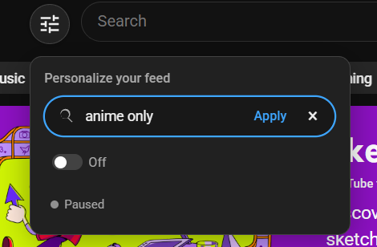
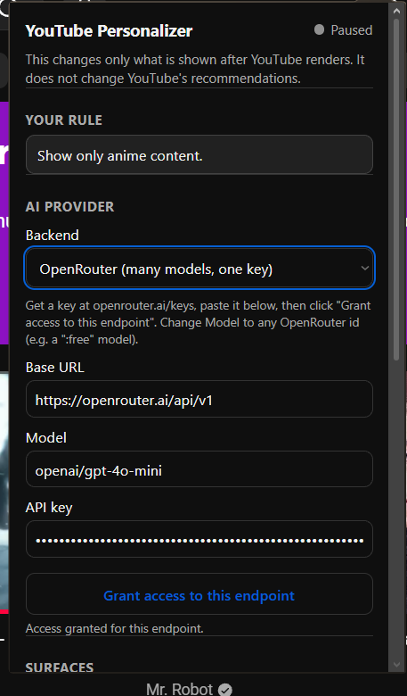

<p align="center">
  
</p>

<h1 align="center">CustomTube</h1>

<p align="center">
  <b>Own your feed.</b><br>
  Tell YouTube what you actually want to watch — in plain English —<br>
  and everything that doesn't fit quietly disappears.
</p>

<p align="center">
  <i>A local, client-side semantic visibility layer for YouTube desktop (Chrome MV3).</i>
</p>

---

> **"Show only anime."** &nbsp;·&nbsp; **"I'm studying — programming and CS, hide music and gaming."** &nbsp;·&nbsp; **"No more doomscrolling or rage-bait."**
>
> You write a rule. CustomTube reads every video card YouTube renders and hides the ones that don't match — continuously, as you scroll.

**CustomTube does _not_ change YouTube's recommendation algorithm.** It changes only what is *shown to you* after YouTube renders the page. Nothing is deleted, nothing is uploaded anywhere you don't control, and one click restores YouTube exactly as it was. It is not an ad blocker and never touches ad slots.

## ▶ See it in action

<p align="center">
  <a href="https://drive.google.com/file/d/1hqg0ZotXJ3UJ8zEiNZfn8htaVKPTv29l/view?usp=sharing">
    
  </a>
</p>
<p align="center">
  <video
    src="https://github.com/user-attachments/assets/94a5e363-c367-4f5d-96bd-ab3676993f7b"
    width="760"
    controls
    playsinline
  ></video>
</p>

## Why you'll like it

- 🗣️ **Rules in plain English.** No filters, no regex, no block-lists to hand-curate. Type *"keep it positive, no rage-bait"* and it just works.
- 🧠 **It understands meaning, not keywords.** Backed by an AI provider you choose, it judges a title by what it *means*, in any language — not by dumb substring matching.
- 🔒 **Private by design.** Everything runs on your machine. At most a tiny `{title, channel}` batch goes to the provider *you* configured. Never your history, cookies, URLs, or the video you're watching.
- ⚡ **Invisible and fast.** One MutationObserver, time-boxed to ~8 ms frames, zero polling, zero layout thrash. You won't feel it running.
- 🛟 **Fails open, always.** Network down, no key, bad response, YouTube redesign — anything that goes wrong just leaves the card visible. It can never blank your feed.
- 🎛️ **You stay in control.** Per-surface toggles, a strictness dial, budget caps, one-click pause, and a full restore. Your key, your rules, your feed.

## The controls

<table>
  <tr>
    <td width="50%" valign="top">
      <br><br>
      <b>One button on the page.</b> A round tune button sits next to YouTube's search bar. Pop it open, type a rule, hit <b>Apply</b> — or flip it off / pause without losing your rule.
    </td>
    <td width="50%" valign="top">
      <br><br>
      <b>Full control in the toolbar.</b> Pick your AI backend (OpenAI, OpenRouter, Gemini, Ollama, LM Studio…), set the model + key, choose which surfaces to filter, and cap your budget.
    </td>
  </tr>
</table>

## Quick start

1. **Get the code** — clone or download this repo.
   ```bash
   git clone https://github.com/Dr4cule/CustomTube.git
   ```
2. **Load it** — open `chrome://extensions`, turn on **Developer mode**, click **Load unpacked**, and select the `CustomTube` folder.
3. **Write a rule** — go to [youtube.com](https://www.youtube.com), click the round **tune** button by the search bar, type something like *"show only programming and CS"*, and hit **Apply**.
4. **(Optional) Add real AI** — open the toolbar popup, pick **OpenAI-compatible**, paste a base URL + model + key, and click **Grant access to this endpoint**.

> 💡 **No provider? Still works.** CustomTube ships with deterministic local rules (structural + strong-signal + affect heuristics) that filter plenty on their own. An AI provider just lets it understand nuance and other languages.

## Signature features

| | Feature | What it does |
| --- | --- | --- |
| 🎭 | **Mood rules ("keep-neutral")** | *"Only positive, uplifting videos"* or *"no more doom and rage-bait"* filters by **tone**, not topic — and never collapses into an empty allow-list that blanks your feed. |
| 🎚️ | **Confidence-gated hiding** | A **strictness dial** (cautious / balanced / aggressive) sets how sure the AI must be before a card is hidden. Cautious hides less; aggressive hides more. |
| 🚫 | **Local affect prefilter** | Catches clickbait / rage-bait (SHOUTING, "you won't believe", 💀, `!!!`) **on-device**, requiring agreement across signals before it hides — works even with the AI off. |
| 📺 | **Channel memory** | Learns a per-channel, per-rule prior with a Wilson lower bound. Once a channel racks up enough agreeing confident verdicts, it's judged instantly — no repeat API calls. |
| 📋 | **Compiled rubric** | Your rule is compiled once into a structured policy (include/exclude topics, duration limits, structural flags) that drives fast local decisions. |
| 🗂️ | **Shared decision cache** | Decisions are cached by `${ruleHash}:${videoId}` in the service worker and optionally persisted with a 7-day TTL — change the rule and every stale decision is invalidated. |
| 🩹 | **Self-healing** | If YouTube ships a DOM change that breaks a surface, CustomTube goes **inert** (everything visible) and tells you selectors need an update — instead of silently hiding the wrong things. |

## Privacy — exactly what leaves your device

**Sent to your provider** (only if you configure one): for each visible, undecided card, a batch of `{ id, title (≤200 chars), channel (≤80 chars), duration?, live? }`, control characters stripped. **Never sent:** URLs, thumbnails, descriptions, transcripts, watch history, cookies, account info, or the video you're currently watching.

**Stored locally** (`chrome.storage.local`): your rule text, its hash, the compiled policy, your settings, and (optionally) the decision cache. Your **API key** lives in a separate entry read **only by the service worker** — the content script never fetches it, and web pages can't touch extension storage at all. **No keys in source, ever.**

**One-click undo:** disable or reload the extension and every marker is removed, restoring YouTube exactly as it was.

## How it works

Every card runs through one decision gate, cheapest check first, stopping as soon as one is confident:

```
cache → structural (Shorts / duration / live) → baseline (strong signals) → local affect → channel memory → semantic (batched AI)
```

- **Structural & baseline** are deterministic and local. The baseline only hides on **unambiguous** phrases ("official music video", "full album", "karaoke"); ambiguous words ("mix", "live", "python", "beats") fall through to the AI.
- **Semantic** classification is batched (≤ 20 cards), asynchronous, and handled by the service worker via your provider — judging by meaning, in any language, treating every title as untrusted text. Validation happens at the content boundary, so a malformed or hostile response can only ever *allow* a card.
- **No provider or circuit open →** undecided cards resolve to **allow** and the UI reads "Local rules only". A circuit breaker disables the AI after 5 straight failures; a budget guard (default 30/min, 500/day) degrades to local rules on cap.

<details>
<summary><b>Architecture &amp; source map</b> (no bundler — the same ES modules run in-page and in Node tests)</summary>

<br>

| File | Role |
| --- | --- |
| `manifest.json` | MV3 manifest. `storage` + YouTube host permission only; provider origins are optional and requested at runtime. |
| `content.js` | Thin loader — dynamic-imports `src/main.js` so the same modules run in-page **and** are unit-testable in Node. |
| `src/main.js` | Content entry. Owns all `chrome.*` calls, wiring storage ↔ classifier ↔ observer ↔ UI. |
| `src/constants.js` | Central config: `SURFACES`, `FIELD_SELECTORS`, `TOPIC_LEXICON`, `STRONG_TERMS`, timeouts, caps, status vocabulary. |
| `src/text.js` | Pure text helpers (normalize, diacritics, word-boundary match, hashing). |
| `src/policy.js` | Local heuristic rule compiler + rule hashing. |
| `src/videoid.js` | Video-id extraction and fallback identity. |
| `src/baseline.js` | Deterministic structural + conservative baseline classification. |
| `src/affect.js` | On-device clickbait / rage-bait affect scoring. |
| `src/channel.js` | Per-(rule, channel) verdict memory with a Wilson lower bound. |
| `src/validate.js` | Strict, fail-open validation of model output. |
| `src/cache.js` | Cache key, in-memory LRU, and pure TTL/cap pruning. |
| `src/metadata.js` | Reads a card's fields from the DOM (legacy + lockup markup). |
| `src/classify.js` | The single decision gate + request batcher. |
| `src/observer.js` | One MutationObserver: recycling, late hydration, SPA nav, selector health. |
| `src/apply.js` | Visibility via attributes only (never inline styles, never node removal). |
| `src/ui.js` | Floating personalizer launcher in a Shadow DOM. |
| `background.js` | MV3 service worker: owns the API key and all AI calls; circuit breaker, budget guard, timeouts/retries. |
| `providers.js` | `openai-compatible` and `none` providers + the classifier/compile prompts. |
| `popup.html/css/js` | Provider config, surface toggles, budget caps, clear-data, live status. |

</details>

## Build &amp; test

No bundler. The same ES modules that run in the page are imported directly by Node for unit tests.

```bash
npm install         # dev dependency: Playwright (for e2e only)
npm test            # unit suite (node:test) — pure logic + a source-grep guard against polling
npm run test:e2e    # acceptance tests (Playwright) against fixtures + a stub AI server
npm run test:load   # sanity-check that the floating launcher mounts
npm run stub        # serve fixtures + stub AI at http://localhost:8730 for manual poking
```

The acceptance suite drives the real modules against both **legacy** (`ytd-rich-item-renderer`) and current **lockup** (`yt-lockup-view-model`) markup with a stub provider, asserting study-rule filtering, stale-result drops, provider-garbage fail-open, context-invalidation restore, element recycling, late hydration, and a 200-card burst.

## Bring your own AI

The single `openai-compatible` provider covers **OpenAI, OpenRouter, Gemini (OpenAI-compatible endpoint), LM Studio, and Ollama (`/v1`)** — just set the base URL, model, and key in the popup.

- **OpenRouter** — one key, hundreds of models; try a `:free` model to start.
- **Gemini** — use `gemini-2.5-flash` on the `v1beta/openai` endpoint.
- **Ollama** — set `OLLAMA_ORIGINS` to allow the `chrome-extension://<id>` origin, or requests are rejected by CORS.

Adding a native backend is a small class with `compilePolicy()` + `classifyBatch()` returning raw model text — see [`providers.js`](providers.js).

## Known limitations

- **Filters, doesn't reorder.** v1 hides/shows only; *"prioritize X"* alone is noted but not acted on (DOM reordering is out of scope).
- **English-first baseline.** Local heuristics are English-centric; other languages lean on the semantic layer.
- **Infinite scroll.** If a whole batch is hidden, YouTube just loads more as you scroll — expected.
- **Default surfaces.** Home and the watch sidebar are on by default; Subscriptions and Search default **off**. Channel pages, playlists, and the video you're watching are never touched.
- **API cost / latency.** Semantic calls hit your provider; the budget guard caps usage and everything degrades to local rules when unavailable.

## To Do
- **Integrate Laya 1.7gb local model (if you can do this, make a pr)

---

<p align="center"><b>I own my feed.</b></p>


